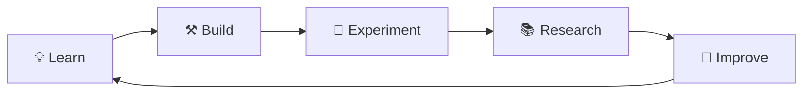

<!-- ===================================================== -->

<!--               ⚡ S-TIER GITHUB PROFILE ⚡              -->

<!-- ===================================================== -->

<div align="center">

#  Runesh Bhardwaj


<p>
  
  
  
  
</p>


</div>

---

```text
╭────────────────────────────────────────────────────────────╮
│  🤖 AI • 🧠 ML • 🔐 Security • ⚙️ Automation • 🎓 Education │
╰────────────────────────────────────────────────────────────╯
```

# 👨‍💻 About

```yaml
name: Runesh Bhardwaj

location: India

roles:
  - Computer Science Educator
  - AI Enthusiast
  - Software Developer
  - Researcher

currently_building:
  - AI Agents
  - Educational Technology
  - Automation Systems
  - Intelligent Applications

motto:
  Build → Learn → Research → Teach → Repeat
```

---

# 🚀 Focus

| 🤖 Artificial Intelligence | 🧠 Machine Learning    | 🔐 Blockchain Security  |
| -------------------------- | ---------------------- | ----------------------- |
| AI Agents                  | Reinforcement Learning | Smart Contract Analysis |
| LLM Workflows              | Prompt Engineering     | Vulnerability Research  |

| 🌐 Development   | ⚙️ Automation         | 🎓 Education       |
| ---------------- | --------------------- | ------------------ |
| Python           | Productivity Systems  | Computer Science   |
| Interactive Apps | Intelligent Workflows | Learning Platforms |

---

# 🛠️ Tech Stack

```text
🐍 Python        ████████████████████
⚡ C++           ████████████████
☕ Java          ███████████████
🌐 HTML/CSS      ███████████████
📜 JavaScript    ████████████
🗄️ SQL           ███████████████
🔧 Git/GitHub    ████████████████
```

---

# 🌟 Featured Projects

## 🐍 Boomslang AI

> Reinforcement Learning powered Snake AI using Deep Q Learning.

## 🧩 Sudoku Solver

> Fast and optimized Python solver using recursive backtracking.

## 📊 Sorting Visualizer

> Interactive visualization of fundamental sorting algorithms.

## 🌐 Educational Platforms

> Modern learning experiences built for accessibility and engagement.

---

# 🔬 Research

```
Blockchain Security
├── Smart Contract Auditing
├── Vulnerability Detection
├── Static Analysis
└── Cybersecurity

Green Technologies
├── Bibliometric Analysis
├── Sustainable Computing
└── Emerging Technology Trends
```

---

# 📈 GitHub Insights

<div align="center">


<br><br>


</div>

---

# 📊 Activity Graph

<div align="center">


</div>

---

# 🏆 Trophies

<div align="center">


</div>

---

# 🧠 Learning Cycle



---

# 📡 Connect

| Platform    | Profile                          |
| ----------- | -------------------------------- |
| 🐙 GitHub   | `github.com/CaptanJackSparr0w`   |
| 💼 LinkedIn | `linkedin.com/in/runeshbhardwaj` |
| 🧪 ORCID    | `orcid.org/0009-0008-8507-9403`  |

---

<details>
<summary><strong>✨ Fun Fact</strong></summary>

I enjoy combining artificial intelligence, education, automation, research, and software engineering to build technology that helps people learn faster and solve meaningful problems.

</details>

---

<div align="center">

## ⭐ *"Turning research into software and software into impact."*

```text
██████╗ ██╗   ██╗██╗██╗     ██████╗
██╔══██╗██║   ██║██║██║     ██╔══██╗
██████╔╝██║   ██║██║██║     ██║  ██║
██╔══██╗██║   ██║██║██║     ██║  ██║
██████╔╝╚██████╔╝██║███████╗██████╔╝
╚═════╝  ╚═════╝ ╚═╝╚══════╝╚═════╝
```

**Thanks for visiting my profile! 🚀**

</div>
