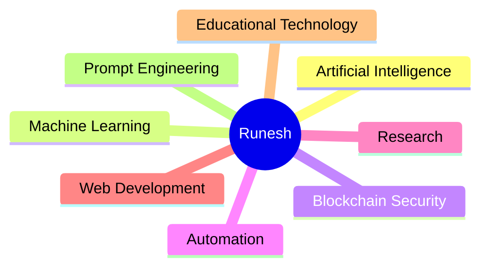

<!-- ===================================================== -->

<!--              🚀 PREMIUM GITHUB PROFILE README          -->

<!-- ===================================================== -->

<div align="center">

# 👋 Hello, I'm <span style="color:#58A6FF">Runesh Bhardwaj</span>


<br>


<br><br>


</div>

---


# 🌌 About Me

```text
💡 Name        :: Runesh Bhardwaj
🎓 Profession  :: Computer Science Educator
🤖 Passion     :: Artificial Intelligence & Automation
🔬 Research    :: Blockchain Security
🌍 Country     :: India
🚀 Mission     :: Build technology that educates, automates, and inspires.
```

I enjoy creating intelligent systems, educational tools, interactive web applications, and research-driven software. My interests span **Artificial Intelligence**, **Machine Learning**, **Blockchain Security**, **Automation**, and **Creative Technology**, with a strong focus on solving practical problems through code.

---

# ⚡ Current Focus

<table>
<tr>
<td align="center">🤖<br><b>Artificial Intelligence</b></td>
<td align="center">🧠<br><b>Machine Learning</b></td>
<td align="center">🔐<br><b>Blockchain Security</b></td>
<td align="center">⚙️<br><b>Automation</b></td>
</tr>
<tr>
<td align="center">🌐<br><b>Web Development</b></td>
<td align="center">🎓<br><b>Education Tech</b></td>
<td align="center">🎨<br><b>UI/UX</b></td>
<td align="center">📚<br><b>Research</b></td>
</tr>
</table>

---

# 🛠️ Tech Arsenal

<div align="center">


</div>

---

# 🚀 Featured Projects

| 🚀 Project               | ✨ Description                                           |
| ------------------------ | ------------------------------------------------------- |
| 🐍 Boomslang AI          | Reinforcement Learning based Snake AI using PyTorch     |
| 🧩 Sudoku Solver         | Intelligent Sudoku solver using optimized backtracking  |
| 📊 Sorting Visualizer    | Interactive visualization of classic sorting algorithms |
| 🌐 Educational Platforms | Responsive learning platforms and student resources     |
| 🤖 AI Experiments        | Exploring automation, prompt engineering, and modern AI |

---

# 🔬 Research

## 📄 Blockchain Smart Contract Security

* Smart Contract Auditing
* Vulnerability Detection
* Static Analysis
* Cybersecurity
* Secure Blockchain Infrastructure

### 🌱 Green Technologies

* Bibliometric Analysis
* Sustainable Computing
* Emerging Technologies
* Environmental Impact Studies

---

# 📈 GitHub Analytics

<div align="center">


<br><br>


</div>

---

# 📊 Activity Graph

<div align="center">


</div>

---

# 🏆 GitHub Trophies

<div align="center">


</div>

---

# 🧠 Learning Journey



---

# 🌍 Let's Connect

<div align="center">

<a href="https://github.com/CaptanJackSparr0w">

</a>

<a href="https://www.linkedin.com/in/runeshbhardwaj">

</a>

<a href="https://orcid.org/0009-0008-8507-9403">

</a>

</div>

---

<div align="center">

## ✨ *"Turning ideas into intelligent systems and research into real-world impact."*


</div>
