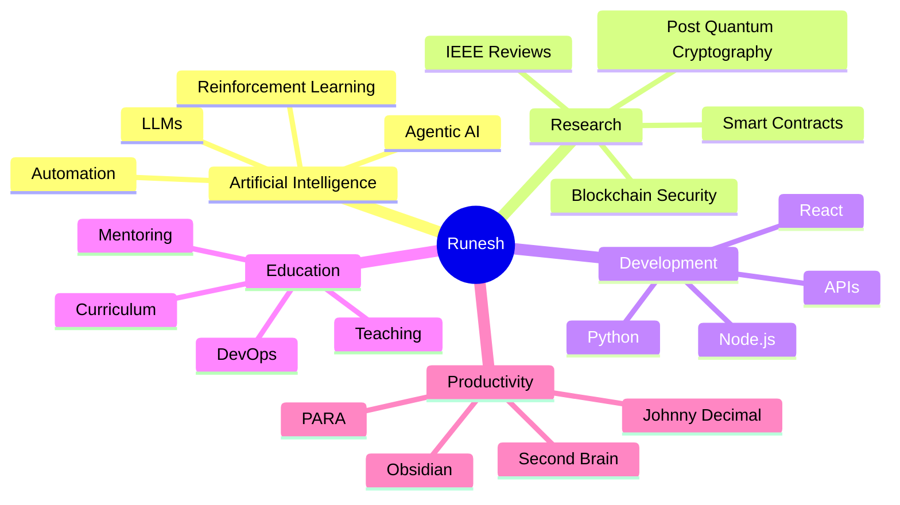
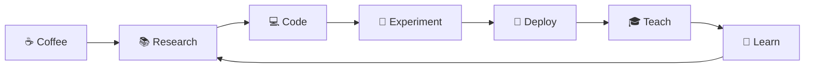
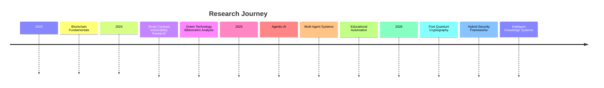

<div align="center">

# 🚀 Runesh Bhardwaj


<br>


</div>

---

<div align="center">

# 👨‍💻 About Me

</div>

```yaml
name: Runesh Bhardwaj

roles:
  - Assistant Professor
  - AI Researcher
  - Full Stack Developer
  - Open Source Builder

location: Himachal Pradesh, India

specializations:
  - Artificial Intelligence
  - Agentic Systems
  - Blockchain Security
  - Post Quantum Cryptography
  - Educational Technology
  - Automation

mission: >
  Research.
  Build.
  Teach.
  Repeat.
```

<div align="center">

> ### *"Transforming research into software and software into impact."*

</div>

---

<div align="center">

# ⚡ Core Domains

| 🤖 AI | 🔐 Security | 🌐 Development | 🎓 Education |
|:---:|:---:|:---:|:---:|
| Agentic AI | Blockchain | React | BCA |
| LLMs | Smart Contracts | Node.js | MCA |
| Automation | PQC | Python | DevOps |
| Prompt Engineering | Cybersecurity | APIs | AI-assisted Teaching |

</div>

---

<div align="center">

# 🛠️ Tech Stack


</div>

---

<div align="center">

# 🚀 Active Projects

| 🚀 Project | Description |
|------------|-------------|
| 🤖 Agentic OS Dashboard | Unified AI ecosystem integrating Obsidian, PARA, Johnny Decimal, Claude and automation |
| 🧠 Second Brain CLI | Semantic search over knowledge bases using AI |
| 🧩 Sudoku Solver | Bitmask + MRV optimized solver with benchmarking |
| 🐍 Boomslang AI | Deep Reinforcement Learning Snake AI |
| 📚 Academic Automation | AI-powered lecture scripts, PPT generation and teaching workflows |

</div>

---

<div align="center">

# 🔬 Research

</div>

| Publication | Focus |
|-------------|-------|
| Analysing Vulnerabilities in Real-World Blockchain Smart Contracts | Smart contract auditing and blockchain security |
| Green Technologies through Bibliometric Analysis | Sustainable computing and emerging technologies |

<div align="center">

### Current Research

Blockchain Security • Post Quantum Cryptography • IEEE Reviews • AI Systems • Hybrid Security Frameworks

</div>

---

<div align="center">

# 🎓 Teaching

```text
━━━━━━━━━━━━━━━━━━━━━━━━━━━━━━━━━━━━━━━━━━━━━━━━━━━━━

🎓 Assistant Professor
• BCA & MCA
• DevOps
• Python
• Web Development
• AI-assisted Learning
• Curriculum Development

━━━━━━━━━━━━━━━━━━━━━━━━━━━━━━━━━━━━━━━━━━━━━━━━━━━━━
```

</div>

---

<div align="center">

# 📈 GitHub Dashboard


<br><br>


<br><br>


</div>

---

<div align="center">

# 🏆 Achievement Wall


</div>

---

<div align="center">

# 📊 Skill Matrix

```text
Python                     ████████████████████
Artificial Intelligence    ██████████████████░
Automation                 █████████████████░░
Machine Learning           ████████████████░░░
React / Node.js            ███████████████░░░░
Blockchain Security        ██████████████░░░░░
Research                   ████████████████░░░
Teaching                   ███████████████████
```

</div>

---

<div align="center">

# 🌌 Currently Learning

</div>

- 🤖 Multi-Agent Systems
- 🧠 LLM Orchestration
- 🔐 Post-Quantum Cryptography
- ⚙️ AI Automation
- 🗂️ Obsidian Knowledge Graphs
- 🚀 Claude API Ecosystem

---

<div align="center">

# 🤝 Collaboration

| AI | Security | Education | Development |
|:--:|:--------:|:---------:|:-----------:|
| Agentic AI | Blockchain | EdTech | Full Stack |
| LLM Tooling | PQC | AI Teaching | Open Source |
| Automation | Research | Curriculum | APIs |

</div>

---

<div align="center">

# 🌍 Connect

<a href="https://github.com/CaptanJackSparr0w">

</a>

<a href="https://linkedin.com/in/runeshbhardwaj">

</a>

<a href="https://twitter.com/BhardwajRunesh">

</a>

<a href="https://instagram.com/captain._.jacksparr0w">

</a>

<a href="https://discord.com/users/CaptnJackSprow">

</a>

<br><br>

<a href="https://orcid.org/0009-0008-8507-9403">

</a>

<a href="mailto:runeshbhardwaj09@gmail.com">

</a>

<a href="https://captanjacksparr0w.github.io/Portfolio/">

</a>

</div>

---

<div align="center">

# ☕ Support

<a href="https://www.buymeacoffee.com/runeshbhardwaj">


</a>

</div>

---

<div align="center">

# 🐍 Contribution Snake

> Enable with GitHub Actions


</div>

---

<div align="center">

# 💭 Philosophy


### **"Blending Artificial Intelligence, Education, and Creative Technology to build meaningful digital experiences."**

</div>


---

<div align="center">

# 🚀 Open Source Philosophy


> ### *"The best code isn't just written—it's shared, improved, and inspires others."*

</div>

---

<div align="center">

# 🧠 Knowledge Graph



</div>

---

<div align="center">

# ⚙️ Daily Workflow



</div>

---

<div align="center">

# 🌟 Experience

</div>

| Role | Description |
|------|-------------|
| 🎓 Assistant Professor | Teaching Computer Science, BCA & MCA |
| 🤖 AI Researcher | Building Agentic AI systems and automation |
| 🔬 Blockchain Researcher | Smart contract security and vulnerability analysis |
| 💻 Full Stack Developer | React, Node.js, Python-based applications |
| ⚡ Automation Engineer | AI-assisted educational and productivity pipelines |

---

<div align="center">

# 🏗️ Architecture Interests

</div>

```text
                    ┌────────────────────┐
                    │    User Request    │
                    └─────────┬──────────┘
                              │
                    ┌─────────▼──────────┐
                    │   Agentic Planner  │
                    └─────────┬──────────┘
                              │
         ┌────────────────────┼────────────────────┐
         │                    │                    │
         ▼                    ▼                    ▼
  Research Agent      Coding Agent        Memory Agent
         │                    │                    │
         └──────────────┬─────┴──────────────┬─────┘
                        ▼                    ▼
                Knowledge Base        Automation Layer
                        │
                        ▼
                  Final Response
```

---

<div align="center">

# 📚 Research Timeline



</div>

---

<div align="center">

# 🔥 Interests

| 🤖 AI | 🔐 Security | 🧠 Research | ⚙️ Automation |
|:-----:|:----------:|:----------:|:-------------:|
| LLMs | Smart Contracts | IEEE Papers | Agentic Systems |
| RL | PQC | Literature Reviews | Claude API |
| AI Agents | Blockchain | Experiments | Productivity |

</div>

---

<div align="center">

# 🎯 2026 Objectives

</div>

- 🚀 Release a production-ready Agentic OS
- 🤖 Build a complete Jarvis-like AI assistant
- 📚 Publish additional blockchain security research
- 🔐 Explore NIST post-quantum cryptography standards
- 🌐 Create AI-powered educational platforms
- 💻 Open source high-quality developer tooling
- 🧠 Build an intelligent second brain ecosystem

---

<div align="center">

# 📊 Current Focus

```text
Artificial Intelligence      ████████████████████ 100%

Agentic Systems              ██████████████████░  95%

Python                       ██████████████████░  95%

Automation                   █████████████████░░  90%

Research                     ████████████████░░░  85%

Blockchain Security          ███████████████░░░░  80%

React / Node.js              ██████████████░░░░░  75%

Post Quantum Cryptography    ████████████░░░░░░░  65%
```

</div>

---

<div align="center">

# 🏆 Fun Facts

💡 I enjoy turning research papers into real software.

📖 I love building systems that automate repetitive work.

🤖 My dream is to create a fully autonomous personal AI ecosystem.

🎓 I believe education becomes more impactful when combined with AI.

☕ Coffee and terminal windows are my favorite productivity tools.

</div>

---

<div align="center">

# 🌌 Terminal

```bash
$ whoami

Runesh Bhardwaj

$ current_role

Assistant Professor
AI Researcher
Developer

$ interests

Artificial Intelligence
Agentic Systems
Blockchain Security
Automation
Education

$ life

while(true){
    Learn();
    Build();
    Research();
    Teach();
    Share();
}
```

</div>

---

<div align="center">

# ⭐ Quote of the Day


</div>

---

<div align="center">

# 🌊 Thanks for Visiting


<br><br>


### 💙 *"Turning Ideas into Code • Code into Research • Research into Impact."*

</div>

### 🐍 1. GitHub Contribution Snake

```md
<p align="center">
  <picture>
    <source
      media="(prefers-color-scheme: dark)"
      srcset="https://raw.githubusercontent.com/CaptanJackSparr0w/CaptanJackSparr0w/output/github-contribution-grid-snake-dark.svg">
    
  </picture>
</p>
```

---

### 📈 2. 3D Contribution Calendar

```md
<div align="center">


</div>
```

---

### 📊 3. Profile Summary Cards

```md
<div align="center">


</div>
```

---

### 🌟 4. Holopin Badge Board (if you use Holopin)

```md
[](https://holopin.io/@YOUR_USERNAME)
```

---

### 🎵 5. Spotify "Now Playing" (Optional)

```md
[](https://spotify-github-profile.kittinanx.com/api/view?uid=YOUR_SPOTIFY_ID)
```

---

### ⏱️ 6. WakaTime Coding Stats (Optional)

```md
<div align="center">


</div>
```

---

### 🎯 7. Visitor Counter

```md
<div align="center">


</div>
```

---

### 🚀 8. Random Dev Quote

```md
<div align="center">


</div>
```

---

### 📅 9. GitHub Metrics

```md
<div align="center">


</div>
```

---

### 💻 10. Terminal Footer

````md
```bash
runesh@github:~$ ./life.sh

✓ Researching Blockchain Security
✓ Building Agentic AI
✓ Teaching Computer Science
✓ Shipping Open Source Projects
✓ Learning Something New Every Day

Status: ████████████████████ 100%
```
````

---

## ⭐ Final Rating

| Category             |         Score |
| -------------------- | ------------: |
| Visual Design        | ⭐⭐⭐⭐⭐ (10/10) |
| Animations           | ⭐⭐⭐⭐⭐ (10/10) |
| Technical Depth      | ⭐⭐⭐⭐⭐ (10/10) |
| Recruiter Appeal     | ⭐⭐⭐⭐⭐ (10/10) |
| Research Showcase    | ⭐⭐⭐⭐⭐ (10/10) |
| Open Source Presence | ⭐⭐⭐⭐⭐ (10/10) |
| Uniqueness           | ⭐⭐⭐⭐⭐ (10/10) |

