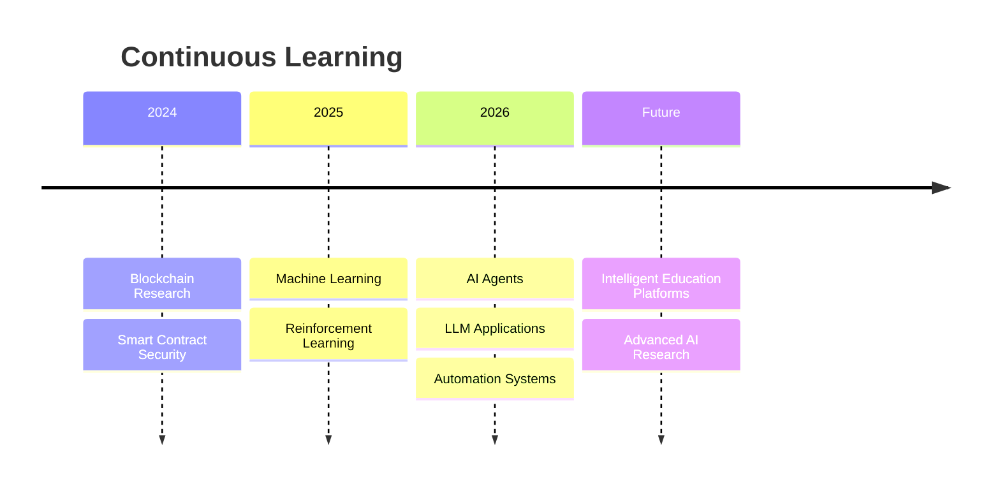

<!-- ========================================================= -->

<!--                  🏆 S-TIER GITHUB PROFILE                  -->

<!-- ========================================================= -->

<div align="center">


<br/>


</div>

---

# 🌌 About Me

```yaml
name: Runesh Bhardwaj

roles:
  - Computer Science Educator
  - AI Enthusiast
  - Developer
  - Researcher

interests:
  - Artificial Intelligence
  - Machine Learning
  - Blockchain Security
  - Educational Technology
  - Automation
  - Web Development
  - Creative Technology

mission: >
  Build intelligent software that helps people learn,
  automate repetitive work, and solve meaningful problems.
```

> I enjoy combining **research**, **education**, **software engineering**, and **AI** to create impactful digital experiences—from reinforcement learning experiments and educational tools to blockchain security research and interactive web applications.

---

# 🚀 Focus Areas

<div align="center">

|        🤖 AI       |          🧠 ML         |   🔐 Security   |   🌐 Web   |
| :----------------: | :--------------------: | :-------------: | :--------: |
|        LLMs        |      Deep Learning     | Smart Contracts | Full Stack |
| Prompt Engineering | Reinforcement Learning | Static Analysis |  Modern UI |

| ⚙️ Automation | 🎓 Education |  📚 Research |    🎨 Design   |
| :-----------: | :----------: | :----------: | :------------: |
|   AI Agents   |    EdTech    | Publications | Interactive UX |

</div>

---

# 🛠️ Tech Stack

<div align="center">

### Languages


### Frameworks & Tools


</div>

---

# 🔬 Research

## 📄 Analysing Vulnerabilities in Real-World Blockchain Smart Contracts

* Smart Contract Auditing
* Blockchain Security
* Vulnerability Detection
* Static Analysis
* Cybersecurity Research

### 🌱 Additional Research

* Green Technologies
* Bibliometric Analysis
* Sustainable Computing
* Emerging Technology Trends

---

# 🚀 Featured Projects

| Project                      | Description                                             |
| ---------------------------- | ------------------------------------------------------- |
| 🐍 **Boomslang AI**          | Reinforcement Learning Snake AI with Deep Q-Learning    |
| 🧩 **Sudoku Solver**         | High-performance recursive Sudoku solver in Python      |
| 📊 **Sorting Visualizer**    | Interactive educational visualization platform          |
| 🌐 **Educational Platforms** | Student-focused responsive web experiences              |
| 🤖 **AI Experiments**        | Prompt engineering, automation, and intelligent systems |

---

# 📊 GitHub Dashboard

<div align="center">


<br/><br/>


</div>

---

# 📈 Contribution Graph

<div align="center">


</div>

---

# 🏆 GitHub Trophies

<div align="center">


</div>

---

# 🌟 Skills Overview

```text
AI & Machine Learning      █████████░
Python Development         ██████████
Research                   ████████░░
Automation                 ████████░░
Web Development            ███████░░░
Blockchain Security        ███████░░░
Educational Technology     █████████░
```

---

# 🧠 Learning Roadmap



---

# 🌍 Connect

<div align="center">

| GitHub                               | LinkedIn                                   | ORCID                                 |
| ------------------------------------ | ------------------------------------------ | ------------------------------------- |
| https://github.com/CaptanJackSparr0w | https://www.linkedin.com/in/runeshbhardwaj | https://orcid.org/0009-0008-8507-9403 |

</div>

---

# 💡 Motto

<div align="center">

## **"Build. Learn. Research. Teach. Repeat."**

</div>

---

# 🐍 Animated Contribution Snake

After enabling the `Platane/snk` GitHub Action in your profile repository, add:

```html
<p align="center">
  <picture>
    <source media="(prefers-color-scheme: dark)" srcset="https://raw.githubusercontent.com/CaptanJackSparr0w/CaptanJackSparr0w/output/github-contribution-grid-snake-dark.svg">
    
  </picture>
</p>
```

---

<div align="center">


### ⭐ Thanks for visiting my profile!


</div>
