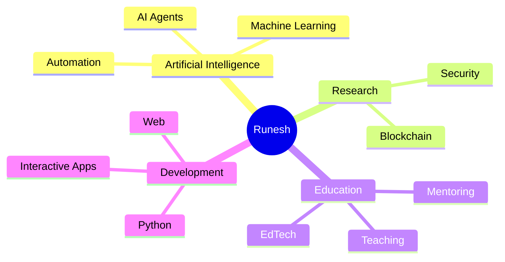

<!-- ========================================================= -->

<!--              🚀 S-TIER GITHUB PROFILE README              -->

<!-- ========================================================= -->

<div align="center">


<br>


<br><br>


</div>

---

#  About Me

```yaml
name: Runesh Bhardwaj

roles:
  - Computer Science Educator
  - AI Enthusiast
  - Software Developer
  - Blockchain Security Researcher

currently_exploring:
  - AI Agents
  - Machine Learning
  - LLM Workflows
  - Educational Technology
  - Intelligent Automation

mission: >
  Build software and research-driven solutions that
  educate, automate, and create real-world impact.
```

I enjoy combining **research**, **artificial intelligence**, **software engineering**, **education**, and **creative problem solving** to build projects that are both technically strong and genuinely useful.

---

# 🚀 What I Build

<div align="center">

|      🤖 AI     |       🔐 Security       | 🌐 Development |      🎓 Education     |
| :------------: | :---------------------: | :------------: | :-------------------: |
| ML Experiments | Smart Contract Analysis |    Web Apps    |   Learning Platforms  |
|  AI Automation |     Static Analysis     | Interactive UI | Programming Resources |
|    AI Agents   |      Cybersecurity      |   Full Stack   |   Digital Classrooms  |

</div>

---

# 🧠 Research

## 🔬 Analysing Vulnerabilities in Real-World Blockchain Smart Contracts

* Smart Contract Auditing
* Vulnerability Detection
* Static Analysis
* Blockchain Security
* Cybersecurity Research

### 🌱 Additional Research

* Green Technologies
* Bibliometric Analysis
* Sustainable Computing
* Emerging Digital Trends

---

# 🏗️ Featured Projects

| Project                      | Highlights                                            |
| ---------------------------- | ----------------------------------------------------- |
| 🐍 **Boomslang AI**          | Deep Q Learning • Reinforcement Learning • PyTorch    |
| 🧩 **Sudoku Solver**         | Python • Optimized Backtracking • Puzzle Intelligence |
| 📊 **Sorting Visualizer**    | Tkinter • Algorithm Animation • Educational Tool      |
| 🌐 **Educational Platforms** | Responsive Design • Student-Centric Experiences       |
| 🤖 **AI Experiments**        | Prompt Engineering • Automation • LLM Exploration     |

---

# ⚡ Tech Stack

<div align="center">

### Languages


### Tools


### Interests


</div>

---

# 📊 GitHub Analytics

<div align="center">


<br><br>


</div>

---

# 📈 Contribution Activity

<div align="center">


</div>

---

# 🏆 Achievements

<div align="center">


</div>

---

# 🌌 Current Journey

```text
Artificial Intelligence      ████████████
Machine Learning             ██████████░░
Python Development           ████████████
Research                     █████████░░░
Automation                   █████████░░░
Blockchain Security          ████████░░░░
Educational Technology       ██████████░░
Web Development              ████████░░░░
```

---

# 🗺️ Vision



---

# 🌐 Connect

<div align="center">

<a href="https://github.com/CaptanJackSparr0w">
  
</a>
&nbsp;
<a href="https://www.linkedin.com/in/runeshbhardwaj">
  
</a>
&nbsp;
<a href="https://orcid.org/0009-0008-8507-9403">
  
</a>

</div>

---

# 💭 Philosophy

<div align="center">

## **“Build intelligently. Teach generously. Research relentlessly.”**


</div>

---

# 🐍 Contribution Snake (Optional)

Enable the `Platane/snk` GitHub Action in your profile repository and add:

```html
<p align="center">
  <picture>
    <source media="(prefers-color-scheme: dark)" srcset="https://raw.githubusercontent.com/CaptanJackSparr0w/CaptanJackSparr0w/output/github-contribution-grid-snake-dark.svg">
    
  </picture>
</p>
```

---

<div align="center">


### ⭐ Thanks for visiting!


</div>
