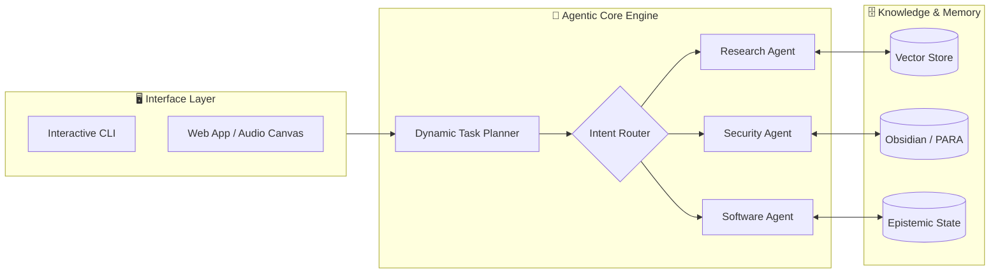
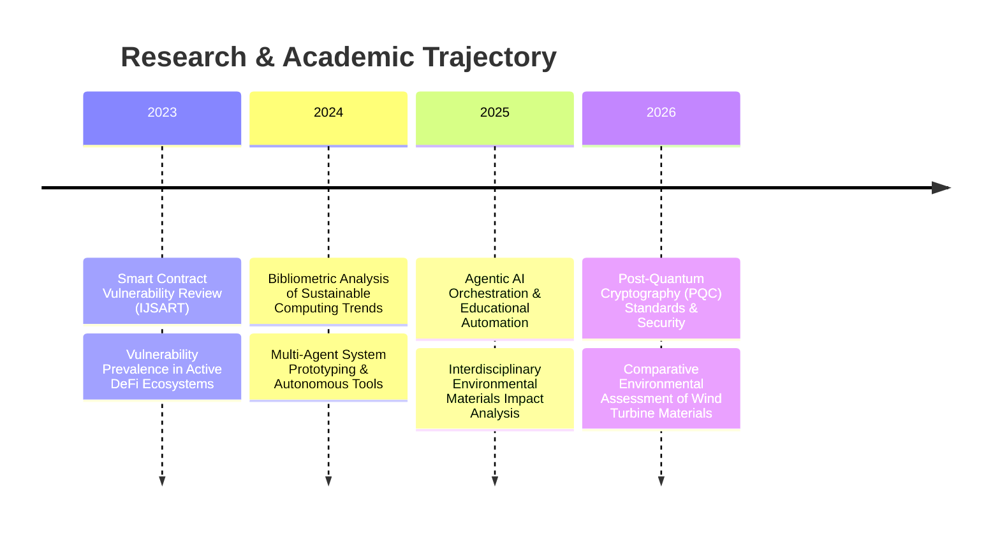

<div align="center">

<!-- ==================== HERO ANIMATED BANNER ==================== -->


<!-- ==================== DYNAMIC TYPING SUBTITLE ==================== -->
<a href="https://github.com/CaptanJackSparr0w">
  
</a>

<br/><br/>

<!-- ==================== STATUS PILLS ==================== -->
[](https://github.com/CaptanJackSparr0w)
&nbsp;
[](https://github.com/CaptanJackSparr0w?tab=followers)
&nbsp;
[](https://github.com/CaptanJackSparr0w?tab=repositories)
&nbsp;
[](https://github.com/CaptanJackSparr0w)
&nbsp;
[](https://maps.google.com/?q=Himachal+Pradesh,+India)

<br/><br/>

<!-- ==================== QUICK NAV BAR ==================== -->
| [🚀 Featured Projects](#-featured--active-projects) | [🧠 AI Architecture](#-agentic-ai--systems-architecture) | [🛠️ Tech Ecosystem](#️-technical-ecosystem) | [🔬 Research](#-research--academic-publications) | [📊 Analytics](#-github-analytics--metrics) | [🌐 Connect](#-connect--collaborate) |
|:---:|:---:|:---:|:---:|:---:|:---:|

</div>

---

### 👨‍💻 Profile Manifest

```yaml
identity:
  name: Runesh Bhardwaj
  title: Assistant Professor & AI Researcher
  location: Himachal Pradesh, India 🇮🇳
  affiliations:
    - Himachal Pradesh University (HPU), Shimla (Research Scholar)
    - Computer Science Educator (BCA, MCA, DevOps, OS)

focus_areas:
  - 🤖 Autonomous Agentic Systems & Multi-Agent Orchestration
  - 🌈 Real-Time Algorithmic Visualizations & Web Audio Synthesis
  - 🔐 Smart Contract Security Audits & Post-Quantum Cryptography (PQC)
  - 📚 Academic Automation, Curriculum Engineering & AI Pedagogy

mantra: >
  "Research fuels innovation. Innovation builds software. Software creates real-world impact."
```

<details open>
<summary><b>🖥️ Interactive Terminal Session (Click to toggle)</b></summary>

<br/>

```bash
runesh@spark-station:~$ ./init_workspace.sh --verbose

[✓] Initializing Neural Knowledge Base ........................ OK
[✓] Synchronizing Multi-Agent Task Orchestrator ............... OK
[✓] Loading Web Audio & HSV Gradient Render Pipelines ......... OK
[✓] Mounting Smart Contract Static Security Analyzers ......... OK
[✓] Compiling Academic Lecture Decks & Lab Workflows .......... OK

System Status: ONLINE | Active Repositories: 22 | Research Mode: ENGAGED
```

</details>

---

### 🧠 Agentic AI & Systems Architecture


```mermaid
flowchart LR
    subgraph Client ["🖥️ Interface Layer"]
        CLI["Interactive CLI"]
        WebUI["Web App / Audio Canvas"]
    end

    subgraph Orchestrator ["🤖 Agentic Core Engine"]
        Planner["Dynamic Task Planner"]
        Router{"Intent Router"}
        ResearchAgent["Research Agent"]
        DevAgent["Software Agent"]
        AuditAgent["Security Agent"]
    end

    subgraph MemoryLayer ["🗄️ Knowledge & Memory"]
        VectorDB[("Vector Store")]
        Obsidian[("Obsidian / PARA")]
        State[("Epistemic State")]
    end

    Client --> Planner
    Planner --> Router
    Router --> ResearchAgent
    Router --> DevAgent
    Router --> AuditAgent
    ResearchAgent <--> VectorDB
    DevAgent <--> State
    AuditAgent <--> Obsidian
```

---

### 🚀 Featured & Active Projects

<div align="center">

| Project | Highlights & Core Capabilities | Stack & Actions |
|:---|:---|:---:|
| 🌈 [**sorting-visualizer-web**](https://github.com/CaptanJackSparr0w/sorting-visualizer-web) | **Interactive Sound & Gradient Sorting Visualizer**<br/>Real-time visualizer mapping array elements to Web Audio API sound synthesis and dynamic HSV rainbow chromatic gradients. Supports QuickSort, MergeSort, BubbleSort, and more. | `JavaScript` `HTML5` `Web Audio` `CSS3`<br/><br/>[**Explore Code**](https://github.com/CaptanJackSparr0w/sorting-visualizer-web) |
| 🧩 [**Sudoku_Solver**](https://github.com/CaptanJackSparr0w/Sudoku_Solver) | **High-Performance Constraint Engine**<br/>Ultra-fast Sudoku solver utilizing bitmask constraint propagation (`1 << n`), Minimum Remaining Values (MRV) heuristics, and extensive benchmarking suites. | `Python` `Algorithms` `Optimization`<br/><br/>[**Explore Code**](https://github.com/CaptanJackSparr0w/Sudoku_Solver) |
| 🔄 [**JSON-to-MD-convertor**](https://github.com/CaptanJackSparr0w/JSON-to-MD-convertor) | **Structured Schema Documenter**<br/>Lightweight CLI utility converting nested, multi-tier JSON payloads and API responses directly into standardized, human-readable Markdown docs. | `Python` `Markdown` `CLI`<br/><br/>[**Explore Code**](https://github.com/CaptanJackSparr0w/JSON-to-MD-convertor) |
| 🌐 [**Portfolio Showcase**](https://github.com/CaptanJackSparr0w/Portfolio) | **Interactive Developer Showcase**<br/>Personal portfolio featuring research papers, project case studies, and engineering highlights. | `HTML5` `CSS3` `JavaScript`<br/><br/>[**Live Vercel**](https://runesh-bhardwaj-portfolio.vercel.app/) • [**GitHub Pages**](https://captanjacksparr0w.github.io/Portfolio/) |
| 📊 [**Sorting-Visualiser.io**](https://github.com/CaptanJackSparr0w/Sorting-Visualiser.io) | **Desktop Algorithm Animator**<br/>Python Tkinter GUI visualizing step-by-step sorting logic, algorithmic comparisons, and operational complexities. | `Python` `Tkinter` `GUI`<br/><br/>[**Explore Code**](https://github.com/CaptanJackSparr0w/Sorting-Visualiser.io) |
| ⛓️ [**Web3.0 Experiments**](https://github.com/CaptanJackSparr0w/Web3.0) | **Decentralized Application Prototypes**<br/>Smart contract interaction harnesses, dApp frontend integrations, and EVM experiments. | `HTML` `JavaScript` `EVM`<br/><br/>[**Explore Code**](https://github.com/CaptanJackSparr0w/Web3.0) |

</div>

<details>
<summary><b>🔍 Click to view Deep-Dive Technical Blueprints</b></summary>

<br/>

#### 1. [sorting-visualizer-web](https://github.com/CaptanJackSparr0w/sorting-visualizer-web)
* **Real-Time Sound Synthesis:** Uses `AudioContext` oscillators with linear frequency ramp mappings to deliver auditory representations of sorting operations.
* **HSV Spectrum Mapping:** Calculates HSV hue angles dynamically ($0^\circ \to 360^\circ$) based on element index and magnitude for smooth color spectrum rendering.

#### 2. [Sudoku_Solver](https://github.com/CaptanJackSparr0w/Sudoku_Solver)
* **Bitmask Pruning:** Maintains $9$-bit bitmasks for rows, columns, and $3 \times 3$ boxes, enabling $O(1)$ candidate validity checks.
* **MRV Heuristic:** Continuously evaluates unassigned cells to pick the variable with the tightest constraints, drastically reducing the search tree depth.

</details>

---

### 🛠️ Technical Ecosystem

<div align="center">


<br/><br/>

| 🤖 **AI & Agentic Systems** | 🔐 **Security & Web3** | 🌐 **Full-Stack & Interactive** | 🎓 **Teaching & Systems** |
|:---|:---|:---|:---|
| • Autonomous Multi-Agent Workflows | • Smart Contract Vulnerability Auditing | • React.js & Next.js Frameworks | • Data Structures & Algorithms (BCA/MCA) |
| • LLM Tool Calling & Prompt Engineering | • Post-Quantum Cryptography (PQC) | • Node.js & Express REST APIs | • Operating Systems & Linux Internals |
| • Deep Q-Learning & Reinforcement Learning | • EVM Security & Threat Modeling | • Modern JavaScript / TypeScript (ES6+) | • DevOps, CI/CD & Automated Grading |
| • Vector Databases & RAG Pipelines | • Cryptographic Protocol Reviews | • Web Audio API & HTML5 Canvas | • Curriculum & Interactive Lab Design |

</div>

---

### 🔬 Research & Academic Publications


```mermaid
timeline
    title Research & Academic Trajectory
    2023 : Smart Contract Vulnerability Review (IJSART)
         : Vulnerability Prevalence in Active DeFi Ecosystems
    2024 : Bibliometric Analysis of Sustainable Computing Trends
         : Multi-Agent System Prototyping & Autonomous Tools
    2025 : Agentic AI Orchestration & Educational Automation
         : Interdisciplinary Environmental Materials Impact Analysis
    2026 : Post-Quantum Cryptography (PQC) Standards & Security
         : Comparative Environmental Assessment of Wind Turbine Materials
```

<details>
<summary><b>📚 Click to expand Academic Contributions & Manuscripts</b></summary>

<br/>

* 📄 **Comparative Environmental and Economic Assessment of Wind Turbine Blade Materials** *(Journal of Polymer & Composites, 2026)*
  * Lifecycle assessment and mechanical viability analysis for sustainable engineering composites.
* 🛡️ **Smart Contract Vulnerabilities: A Literature Review** *(IJSART)*
  * Systematic analysis of attack vectors in EVM contracts including reentrancy, integer overflows, and oracle manipulations.
* 🔍 **Analysing Vulnerabilities in Real-World Blockchain Smart Contracts** *(Academic Archive)*
  * Empirical study on decentralized finance security, formal audit verification, and defense-in-depth strategies.

</details>

---

### 📊 GitHub Analytics & Metrics

<div align="center">

<a href="https://github.com/CaptanJackSparr0w">
  
</a>
&nbsp;
<a href="https://github.com/CaptanJackSparr0w">
  
</a>

<br/><br/>

<a href="https://github.com/CaptanJackSparr0w">
  
</a>

<br/><br/>

<a href="https://github.com/CaptanJackSparr0w">
  
</a>

</div>

---

### ⭐ Quote of the Day

<div align="center">


</div>

---

### 🌐 Connect & Collaborate

<div align="center">

<!-- Interactive Social Badges Grid -->
<a href="https://github.com/CaptanJackSparr0w">
  
</a>
&nbsp;&nbsp;&nbsp;&nbsp;
<a href="https://linkedin.com/in/runeshbhardwaj">
  
</a>
&nbsp;&nbsp;&nbsp;&nbsp;
<a href="https://x.com/BhardwajRunesh">
  
</a>
&nbsp;&nbsp;&nbsp;&nbsp;
<a href="https://runesh-bhardwaj-portfolio.vercel.app/">
  
</a>
&nbsp;&nbsp;&nbsp;&nbsp;
<a href="https://captanjacksparr0w.github.io/Portfolio/">
  
</a>
&nbsp;&nbsp;&nbsp;&nbsp;
<a href="mailto:runeshbhardwaj99@gmail.com">
  
</a>

<br/><br/>

<!-- Footer Waving Banner -->


</div>
