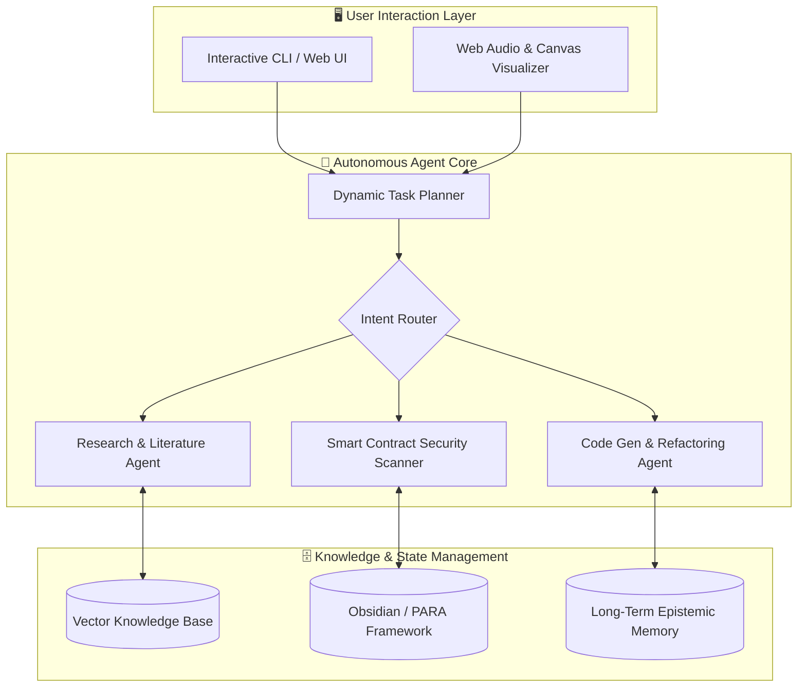
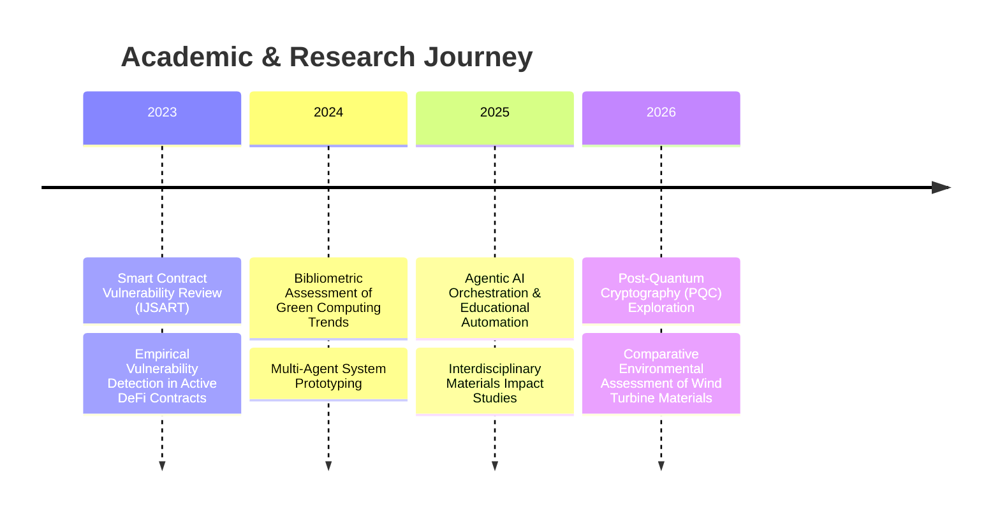

<div align="center">

<!-- Animated Header Banner -->


<!-- Dynamic Animated Typing Subtitle -->
<a href="https://github.com/CaptanJackSparr0w">
  
</a>

<br/>

<!-- Interactive Badges Navigation -->
[](https://github.com/CaptanJackSparr0w)
[](https://github.com/CaptanJackSparr0w?tab=followers)
[](https://github.com/CaptanJackSparr0w?tab=repositories)
[](https://github.com/CaptanJackSparr0w)
[](https://maps.google.com/?q=Himachal+Pradesh,+India)

<br/><br/>

<!-- Quick Navigation Bar -->
**[🚀 Featured Projects](#-featured--active-projects)** • **[🧠 AI Architecture](#-agentic-ai--systems-architecture)** • **[🛠️ Tech Stack](#️-technical-ecosystem)** • **[🔬 Research](#-research--academic-publications)** • **[📊 Analytics](#-github-analytics--metrics)** • **[🌐 Connect](#-connect--collaborate)**

</div>

---

### 👨‍💻 Executive Summary

```yaml
name: Runesh Bhardwaj
location: Himachal Pradesh, India 🇮🇳
roles:
  - 🎓 Assistant Professor & Computer Science Educator
  - 🤖 AI Researcher (Agentic Systems & Multi-Agent Orchestration)
  - 💻 Full-Stack Software Engineer & Open-Source Builder
  - 🔬 Blockchain & Post-Quantum Cryptography Researcher

mission: >
  To bridge theoretical academic research with high-performance,
  interactive software solutions that automate workflows and empower learners.
```

<details>
<summary><b>⚡ Click to inspect Interactive Developer Terminal & System Status</b></summary>

<br/>

```bash
$ runesh --version
Runesh Bhardwaj v2026.8 (x86_64-linux-gnu)

$ runesh --status
● Agentic Systems       [ACTIVE] - Multi-agent task decomposition & orchestration
● Algorithm Visualizer  [ACTIVE] - Web Audio API + HSV Canvas spectrum visualizer
● Smart Contract Audit  [ACTIVE] - Automated vulnerability scanning (Reentrancy, Access Control)
● Academic Pipelines    [ACTIVE] - Automated lecture decks & curriculum scaffolding

$ runesh --life-loop
while (alive) {
    studyNewResearch();
    prototypeSoftware();
    teachAndMentor();
    shipOpenSource();
}
```

</details>

---

### 🧠 Agentic AI & Systems Architecture


```mermaid
flowchart TB
    subgraph UI_Layer ["🖥️ User Interaction Layer"]
        CLI["Interactive CLI / Web UI"]
        Audio["Web Audio & Canvas Visualizer"]
    end

    subgraph Agent_Core ["🤖 Autonomous Agent Core"]
        Planner["Dynamic Task Planner"]
        Router{"Intent Router"}
        ResearchAgent["Research & Literature Agent"]
        CodingAgent["Code Gen & Refactoring Agent"]
        SecurityAgent["Smart Contract Security Scanner"]
    end

    subgraph Knowledge_Layer ["🗄️ Knowledge & State Management"]
        VectorDB[("Vector Knowledge Base")]
        PARA[("Obsidian / PARA Framework")]
        Memory[("Long-Term Epistemic Memory")]
    end

    CLI --> Planner
    Audio --> Planner
    Planner --> Router
    Router --> ResearchAgent
    Router --> CodingAgent
    Router --> SecurityAgent
    ResearchAgent <--> VectorDB
    CodingAgent <--> Memory
    SecurityAgent <--> PARA
```

---

### 🚀 Featured & Active Projects

<div align="center">

| Project | Highlights & Capabilities | Stack & Links |
|:---|:---|:---:|
| 🌈 [**sorting-visualizer-web**](https://github.com/CaptanJackSparr0w/sorting-visualizer-web) | Real-time interactive sorting algorithm visualizer with Web Audio API sound synthesis and HSV rainbow spectrum gradients. | `JavaScript` `HTML5` `Web Audio` `CSS3`<br/>[**Explore Repo**](https://github.com/CaptanJackSparr0w/sorting-visualizer-web) |
| 🧩 [**Sudoku_Solver**](https://github.com/CaptanJackSparr0w/Sudoku_Solver) | Ultra-fast constraint propagation solver powered by bitmask representation, MRV heuristics, and benchmarking suites. | `Python` `Algorithms` `Optimization`<br/>[**Explore Repo**](https://github.com/CaptanJackSparr0w/Sudoku_Solver) |
| 🔄 [**JSON-to-MD-convertor**](https://github.com/CaptanJackSparr0w/JSON-to-MD-convertor) | Developer CLI utility translating deeply nested JSON schemas into structured, publishable Markdown documentation. | `Python` `CLI` `Markdown`<br/>[**Explore Repo**](https://github.com/CaptanJackSparr0w/JSON-to-MD-convertor) |
| 🌐 [**Portfolio Showcase**](https://github.com/CaptanJackSparr0w/Portfolio) | Modern personal developer portfolio highlighting research manuscripts, production builds, and interactive demos. | `HTML5` `CSS3` `JavaScript`<br/>[**Live Site**](https://runesh-bhardwaj-portfolio.vercel.app/) • [**Pages**](https://captanjacksparr0w.github.io/Portfolio/) |
| 📊 [**Sorting-Visualiser.io**](https://github.com/CaptanJackSparr0w/Sorting-Visualiser.io) | Interactive desktop application showcasing sorting steps, time complexities, and comparisons in Python Tkinter. | `Python` `Tkinter` `GUI`<br/>[**Explore Repo**](https://github.com/CaptanJackSparr0w/Sorting-Visualiser.io) |
| ⛓️ [**Web3.0 Experiments**](https://github.com/CaptanJackSparr0w/Web3.0) | Decentralized application interfaces and smart contract testing harness for EVM blockchain interactions. | `HTML` `JavaScript` `EVM`<br/>[**Explore Repo**](https://github.com/CaptanJackSparr0w/Web3.0) |

</div>

<details>
<summary><b>🔍 Click to expand detailed project specifications & architectures</b></summary>

<br/>

#### 1. [sorting-visualizer-web](https://github.com/CaptanJackSparr0w/sorting-visualizer-web)
* **Audio Synthesis:** Employs the browser Web Audio API to map array element values directly to audio oscillator frequencies for auditory algorithmic feedback.
* **Visual Representation:** Dynamic HSV color wheel gradient mapping providing continuous chromatic transitions during comparisons, swaps, and sorted validations.
* **Algorithms Implemented:** QuickSort, MergeSort, BubbleSort, InsertionSort, and SelectionSort with variable playback throttling.

#### 2. [Sudoku_Solver](https://github.com/CaptanJackSparr0w/Sudoku_Solver)
* **Bitmask Constraint Propagation:** Fast bitwise operations (`1 << n`) representing candidate sets for each row, column, and 3x3 grid box.
* **Minimum Remaining Values (MRV) Heuristic:** Prioritizes cells with the fewest remaining legal choices to minimize backtracking tree depth.

#### 3. [JSON-to-MD-convertor](https://github.com/CaptanJackSparr0w/JSON-to-MD-convertor)
* Converts API outputs, configuration files, and schema definitions into standardized markdown documentation ready for GitHub wikis and READMEs.

</details>

---

### 🛠️ Technical Ecosystem

<div align="center">

<!-- Animated Skill Icons -->


<br/><br/>

| 🤖 **AI & Agentic Systems** | 🔐 **Security & Cryptography** | 🌐 **Full-Stack & Web** | 🎓 **Teaching & Systems** |
|:---|:---|:---|:---|
| • Autonomous Multi-Agent Workflows | • Smart Contract Vulnerability Auditing | • React.js & Next.js Frameworks | • Data Structures & Algorithms (BCA/MCA) |
| • LLM Tool Calling & Prompt Engineering | • Post-Quantum Cryptography (PQC) | • Node.js & Express REST APIs | • Operating Systems & Unix Architecture |
| • Deep Q-Learning & Reinforcement Learning | • EVM Security & Formal Analysis | • Modern JavaScript / TypeScript (ES6+) | • DevOps, CI/CD & GitHub Actions |
| • Knowledge Graphs & Obsidian Workflows | • Cryptographic Protocol Reviews | • Web Audio API & HTML5 Canvas | • Interactive Lab & Curriculum Design |

</div>

---

### 🔬 Research & Academic Publications


```mermaid
timeline
    title Academic & Research Journey
    2023 : Smart Contract Vulnerability Review (IJSART)
         : Empirical Vulnerability Detection in Active DeFi Contracts
    2024 : Bibliometric Assessment of Green Computing Trends
         : Multi-Agent System Prototyping
    2025 : Agentic AI Orchestration & Educational Automation
         : Interdisciplinary Materials Impact Studies
    2026 : Post-Quantum Cryptography (PQC) Exploration
         : Comparative Environmental Assessment of Wind Turbine Materials
```

<details>
<summary><b>📚 Click to view peer-reviewed publications & abstracts</b></summary>

<br/>

* 📄 **Comparative Environmental and Economic Assessment of Wind Turbine Blade Materials** *(Journal of Polymer & Composites, 2026)*
  * *Focus:* Lifecycle assessment, ecological sustainability, and mechanical performance comparisons for next-generation composite structures.
* 🛡️ **Smart Contract Vulnerabilities: A Literature Review** *(International Journal of Scientific Advancement in Research and Technology)*
  * *Focus:* Systematic categorization of Ethereum smart contract vulnerabilities (reentrancy, integer overflow, unchecked calls) and automated auditing techniques.
* 🔍 **Analysing Vulnerabilities in Real-World Blockchain Smart Contracts** *(Academic Archive)*
  * *Focus:* Empirical study on decentralized finance security, audit frameworks, and verification protocols.

</details>

---

### 📊 GitHub Analytics & Metrics

<div align="center">


&nbsp;


<br/><br/>


<br/><br/>


</div>

---

### 🌐 Connect & Collaborate

<div align="center">

<!-- Interactive Social Icons -->
<a href="https://github.com/CaptanJackSparr0w">
  
</a>
&nbsp;&nbsp;
<a href="https://linkedin.com/in/runeshbhardwaj">
  
</a>
&nbsp;&nbsp;
<a href="https://x.com/BhardwajRunesh">
  
</a>
&nbsp;&nbsp;
<a href="https://runesh-bhardwaj-portfolio.vercel.app/">
  
</a>
&nbsp;&nbsp;
<a href="https://captanjacksparr0w.github.io/Portfolio/">
  
</a>
&nbsp;&nbsp;
<a href="mailto:runeshbhardwaj99@gmail.com">
  
</a>

<br/><br/>

<!-- Footer Wave Animation -->


</div>
